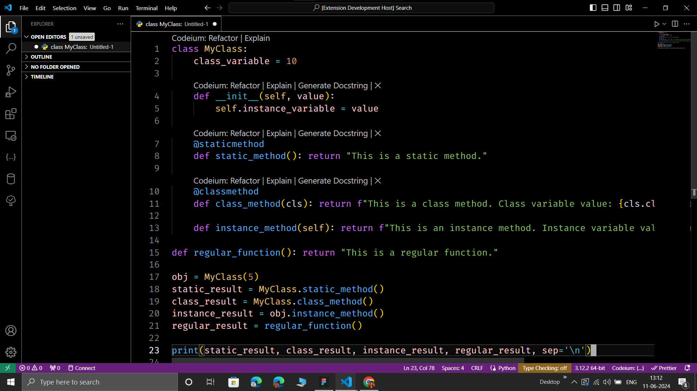

# DarkEST Theme for Visual Studio Code

The DarkEST theme is a visually immersive dark color scheme designed for Visual Studio Code. With deep, moody tones and customized syntax highlighting, this theme aims to provide a comfortable and aesthetically pleasing environment for coding.

Developers can rest their eyes from light and bugs with the DarkEST theme, crafted to reduce eye strain during long coding sessions. The dark color scheme creates a focused atmosphere while maintaining readability and clarity.

## Features

- Deep, moody tones for an immersive coding experience
- Customized syntax highlighting for improved code comprehension
- Reduced eye strain during prolonged coding sessions
- Comprehensive support for popular programming languages and file types

## Installation

1. Open **Extensions** sidebar panel in Visual Studio Code.
2. Search for `DarkEST Theme`.
3. Click **Install** to install it.
4. Click **Reload** to reload the editor.
5. Navigate to **File > Preferences > Color Theme** and select **DarkEST Theme**.

## Theme looks

## Feedback

If you encounter any issues or have suggestions for improvement, feel free to [open an issue](https://github.com/rakeshkanna-rk/darkEST/issues) on GitHub.

## License
Author: [Rakesh Kanna](https://github.com/rakeshkanna-rk)

This project is licensed under the [MIT License](LICENSE).

